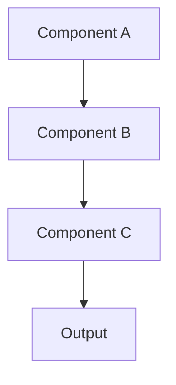

# DESIGN: Feature Name

## Problem Statement

_What problem are we solving and why?_

## Requirements

_Functional and non-functional requirements_

## Constraints

_Technical, business, or timeline constraints_

## Options Analysis

### Option 1: Approach Name

**Pros:**

- Benefit 1
- Benefit 2

**Cons:**

- Drawback 1
- Drawback 2

**Complexity:** Low/Medium/High

### Option 2: Alternative Approach

_Similar analysis..._

## Architecture Diagram

## Recommended Approach

_Which option and why_

## Implementation Plan

1. Task 1 - Brief description
2. Task 2 - Brief description
3. Task 3 - Brief description

## Risks & Mitigations

- **Risk:** Description
  - **Mitigation:** How to address

## Success Criteria

_How we'll know this is working correctly_
