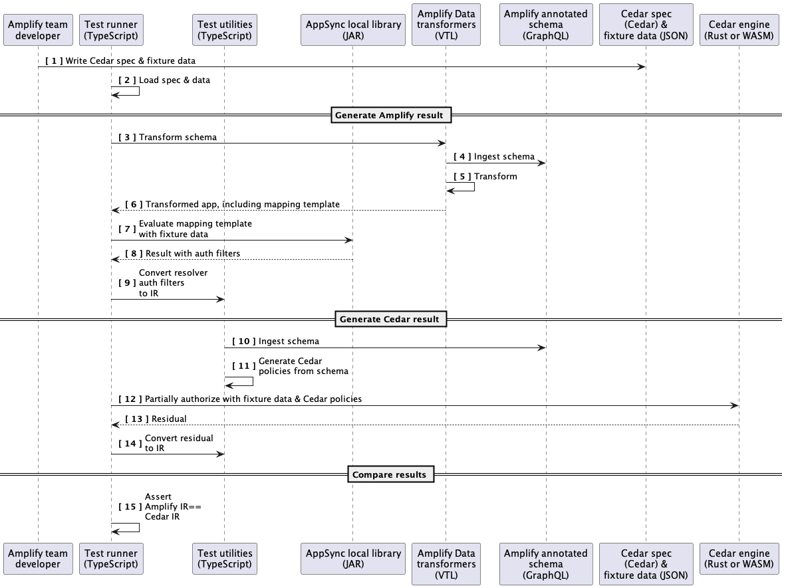

# amplify-auth-drt

## Purpose

This package uses model-based Differential Testing to compare results of Amplify's production fine-grained authorization implementation with models written in [Cedar][https://www.cedarpolicy.com/].

The models are intentionally simplified versions of the auth implementation.

In some cases, input is generated via [fast-check](https://github.com/dubzzz/fast-check) to provide random fuzzing to the input data.

## Tenets (unless you know better ones)

- **The model is the spec.** The auth specification should be understandable by humans and analyzable by machines.
- **The model is exhaustive.** The spec should eventually cover all auth cases. Where we identify gaps in the model's coverage, we will work to close them.
- **The model is unambiguous.** The spec should make explicit the existing implicit behaviors (e.g., additional fields, naming assumptions) to make them easy to see and reason about.
- **Testing is fast.** Tests should be quick to run, and parallelizable. We should be able to execute these tests regularly to ensure we have coverage without dramatically impacting our ability to release.

## Test execution

In the sequence diagram below, we are testing a dynamic auth case, which returns a partially-evaluated decision.

**Callouts**

**1**- Fixture data is common to both evaluations: identity information about the requester, entity information about the data being retrieved, etc. 
   - Optional future state — we will generate Cedar spec from the Amplify @auth-annotated schema

**5**- Amplify generates mapping templates in VTL

**7**- Dynamic auth (that is, auth relying on the data itself to provide context for the authorization) will result in an “auth filter”. (See Appendix C: Partial evaluation comparisons with example data)

**9**- Amplify’s Cedar policies will have some shared high-level entity types (e.g., a “Cognito User” type, a “Public API Key User” type, etc). But the Cedar policy itself will be either hand-written for a specific case, or generated from the Amplify @auth rules in the schema.

**12**- Like #7 above, a dynamic auth decision will result in a partial evaluation. (See Appendix C: Partial evaluation comparisons with example data)

**15**- The assertion for static auth will simply be: Did Amplify and Cedar return the same concrete auth decision? The assertion for dynamic auth will be: Did Amplify and Cedar return the same partial evaluation?

_[Source: testing-sequence.puml](./testing-sequence.puml)_
