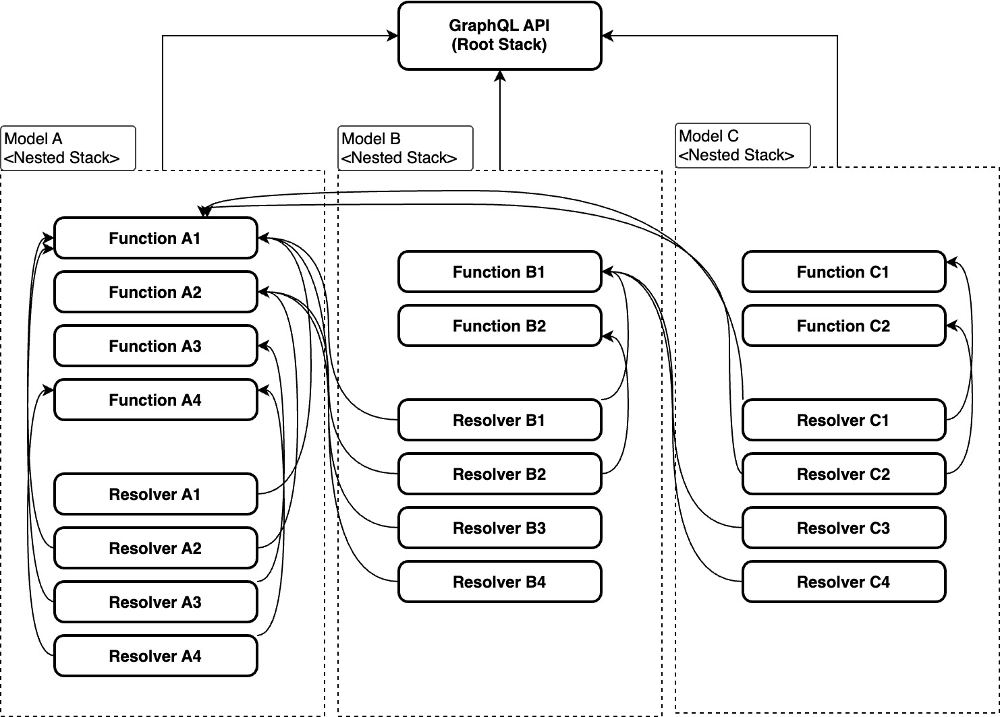
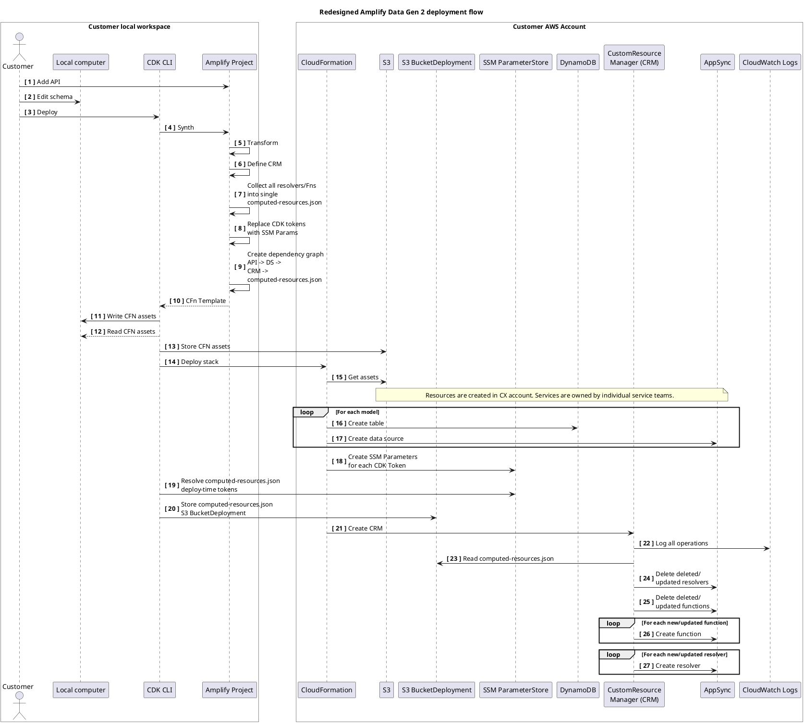
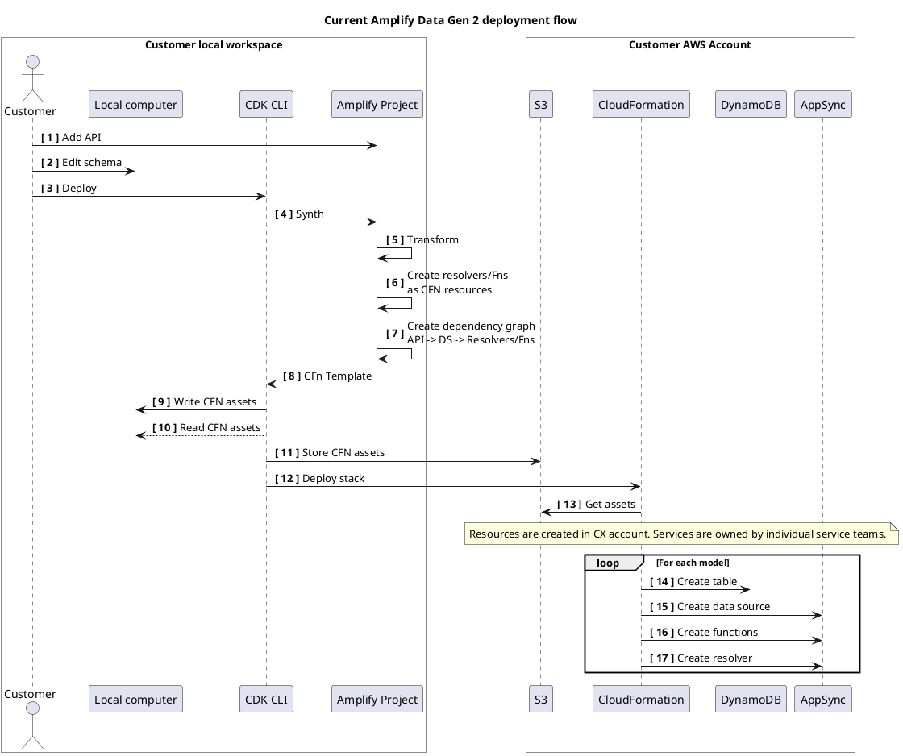

# Amplify Data resource management strategy experimental redesign to address CloudFormation (CFN) resource limits

## Problem

Some customers with large APIs encounter deployment errors due to CloudFormation (CFN) limits on the number of resources in a stack, or the number of resource operations that can be performed in a single stack update. When this happens, customers are unable to make any changes to their application. All subsequent deployments result in one of the errors below.

Customers run into two type of CFN limits during deployment,

1. 2500 operations per stack update, which manifests as an error like:

```
UPDATE_ROLLBACK_IN_PROGRESS with reason: Limit on the number of resources
in a single stack operation exceeded
```

1. 500 resources per stack, which manifests as an error like:

```
Error: Number of resources in stack 'XXX':
XXXis greater than allowed maximum of 500
```

This design addresses both issues for Gen 2 customers by allowing them to opt-in to an experimental resource handling strategy that uses an AWS Custom Resource to manage AppSync Resolvers and Functions. In this proposal, CFN sees a single custom resource, but behind the scenes, it handles the lifecycle for each of the individual Resolvers and Functions that were previously declared as single CFN resources.

NB: The proposed design is not suitable for Gen 1 customers.

## Current Amplify Data resource management strategy

In the current strategy, AppSync Resolvers and Functions are created as individual CloudFormation resources, and assigned to the relevant Model Stack or Connection Stack.

To reduce the number of resources created, we reuse AppSync functions that share the same code. For example, some auth initialization functions may be the same across models, setting the same identity context variables. While this reduces the number of resources, it increases the overall interconnectedness of the resource graph: many model stacks will depend on a function in model stack. For example, from the below diagram, Function A1 is referenced by several resolvers from stacks ModelA, ModelB and ModelC. If the schema change result in removing Function A1, it will trigger an update to all the resolvers that was depending on it. In one test project with ~80 models, 7 AppSync functions were referenced more than 3200 times in the nested stacks.



_(Credit: [@sundersc](http://github.com/sundersc))_

### Redesigned Amplify Data Gen 2 deployment flow



## Customer migration

## Tradeoffs

## Edge cases

## Next steps

## Appendices

### Current Gen2 deployment strategy

In the current strategy, Amplify creates each AppSync Resolver and Function as a single CFN resource.



In this flow:

1. A customer adds and (2) edits their API, then invokes a deploy (3) via cdk deploy or an Amplify sandbox or pipeline deploy.

2. CDK synthesizes resources by invoking Amplify’s constructs

3. Amplify transforms the customer’s input GraphQL schema into (6) AppSync functions and resolver definitions as individual CFN resources. It sets dependencies and returns those definitions in-memory (7) to CDK.

4. CDK writes the in-memory definitions as CFN templates and assets to the local workspace.

5. CDK reads the assets, uploads them to a CDK-managed S3 bucket (11) and invokes a CFN stack operation (12).

6. CFN creates a model stack for each Amplify model. As it processes each model stack, CFN creates a DDB table (14), AppSync Data Source (15), necessary AppSync resolver functions (16), and a pipeline resolver (17) per Figure: Amplify stack dependency graph

As noted in [Resource dependency graph](#resource-dependency-graph), if the CFN operation includes an update to a shared function, each affected resolver will be updated with a CFN `UPDATE` operation. In larger schemas this will result in the “Limit on the number of resources in a single stack operation exceeded” error.
